# CMOS Bandgap Reference Voltage Circuit

**ENSC 325 — Analog IC Design, Simon Fraser University**

A CMOS bandgap reference (BGR) circuit, designed from first principles and
verified in OrCAD X / PSpice. The goal: a stable ~1.2V reference voltage
that holds steady across temperature and supply variation, built entirely
on a course-provided 5μm CMOS process.

## Objective & Constraints

- Deliver a stable output voltage, independent of temperature and supply
  variation, with a temperature coefficient (TC) target of **≤ 100 ppm/°C**
- Use PTAT (Proportional to Absolute Temperature) and CTAT (Complementary
  to Absolute Temperature) current strategies to cancel out thermal drift
- Stay power-efficient enough for energy-sensitive applications (e.g. IoT)
- Build entirely on the provided 5μm CMOS transistor models, simulated in
  OrCAD X
- Include reliable startup circuitry, since bandgap current-mirror circuits
  don't self-start from a powered-off state

## Topology Selection: Current Mirror vs. Brokaw Cell

Two established BGR topologies were compared: the **Brokaw cell** (BJTs +
op-amp feedback, precise but complex to bias and match) and a **current
mirror** based design (simpler CMOS implementation, fewer components,
better suited to low-power/compact layouts).

| Brokaw Cell | Widlar Current Mirror |
|---|---|
| 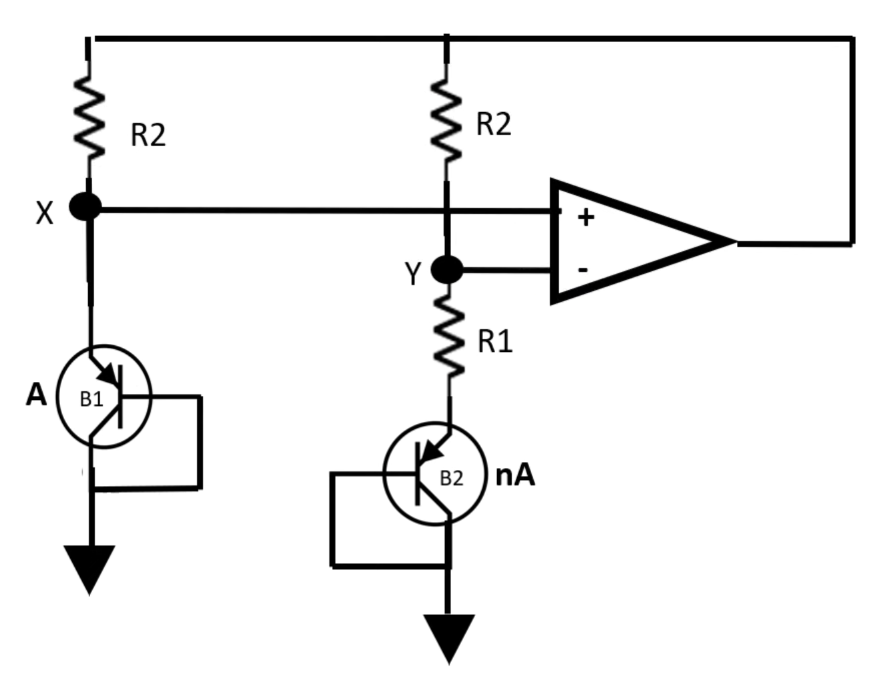 | 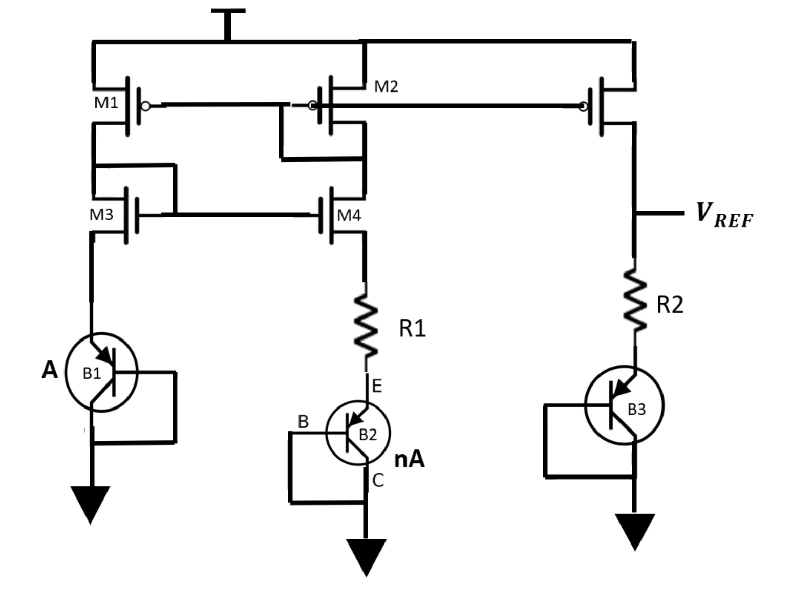 |

The **current mirror topology was chosen** — it traded some theoretical
precision for simpler implementation, easier debugging, and faster design
iteration in OrCAD X, while still meeting the project's accuracy target.

## Theory: PTAT + CTAT

A diode-connected BJT's base-emitter voltage is proportional to thermal
voltage:

```
v_BE ≈ V_T · ln(I_C / I_S)        V_T = kT / q
```

Differentiating v_BE with respect to temperature gives a **CTAT**
(complementary-to-absolute-temperature) term. Separately, the *difference*
in base-emitter voltage between two differently-sized BJTs is:

```
Δv_BE = V_T · ln(n)
```

...which is **PTAT** (proportional-to-absolute-temperature). Summing a
PTAT and a CTAT term in the right ratio cancels the temperature dependence
of each, producing a net-zero-drift reference:

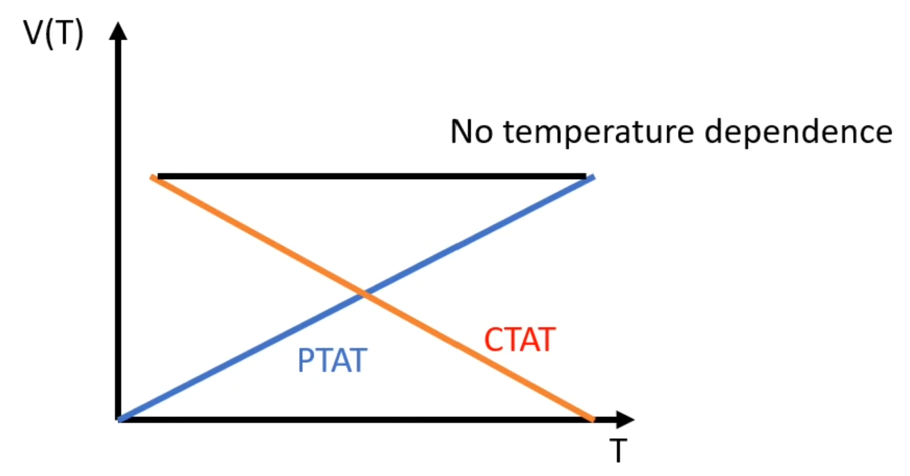

### Bandgap core

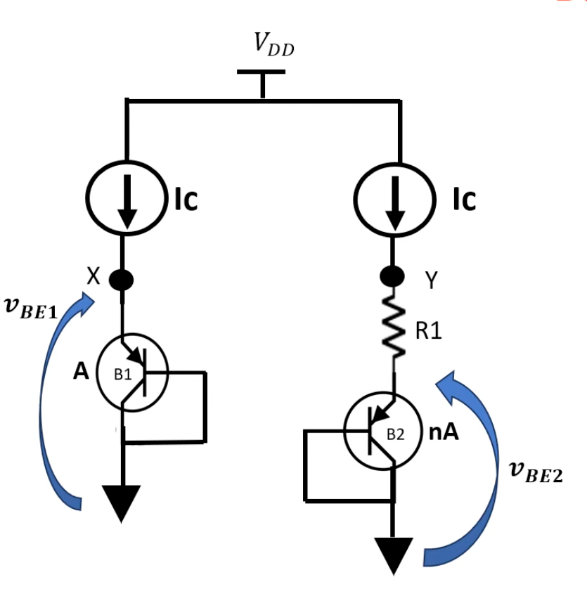

Two matched current sources bias a diode-connected BJT (B1, area A) and a
second, larger BJT (B2, area nA) in series with resistor R1. Working
through the node equations at Y:

```
V_Y = V_BE2 + V_T · ln(n)
```

Adjusting the area scale factor `n` could in principle zero out the
temperature dependence at Y directly, but the required `n` is impractically
large (~10⁷). Instead, a **third output branch** (R2, B3) mirrors the PTAT
bias current to produce a practical, tunable reference:

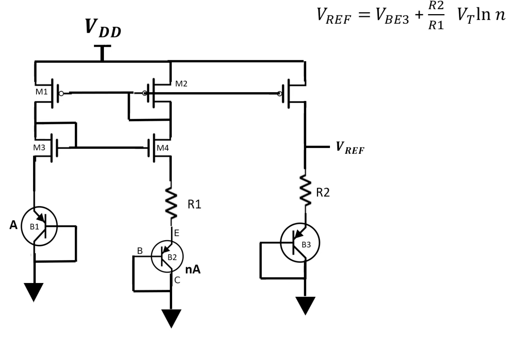

```
V_REF = V_BE3 + (R2 / R1) · V_T · ln(n)
```

Two PMOS (M1, M2) and two NMOS (M3, M4) transistors form a cascoded current
mirror — the cascode arrangement reduces the effect of mismatched drain
voltages between M1/M2 and increases output impedance, keeping the mirrored
current stable.

### Startup circuit

Current-mirror BGR circuits have a degenerate "off" state where every
branch sits at zero current — nothing pulls it into the correct operating
point after power-on. A dedicated startup circuit (M5–M8) forces the mirror
into its correct bias state every time the circuit powers on, then
disconnects itself once normal operation is reached:

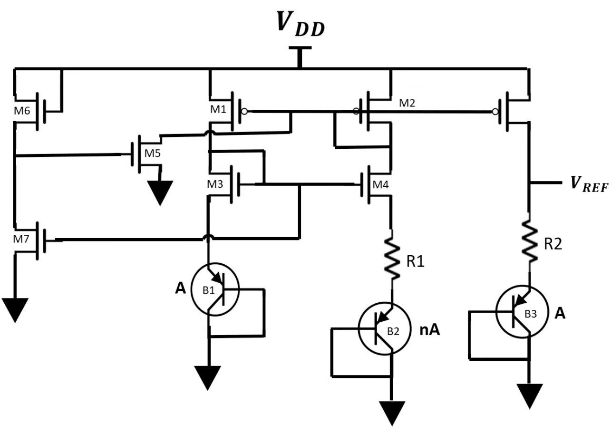

PMOS M5/M6 pull the gates of M1, M2, and M8 down on startup. Once current
starts flowing through the main branch, M7 turns on and pulls M5's gate
back up, turning the startup circuit off and disconnecting it from the
rest of the mirror — so it only intervenes at power-on, never during normal
operation.

## OrCAD X Implementation

SPICE models for the 5μm CMOS transistors came from the course lab
documentation; the 2N3906 PNP BJT models (used for the CTAT/PTAT branches)
were sourced from DigiKey.

| Current mirror + PTAT biasing | Finalized BGR circuit |
|---|---|
| 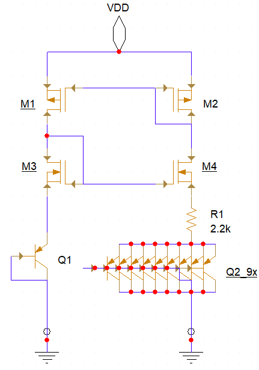 | 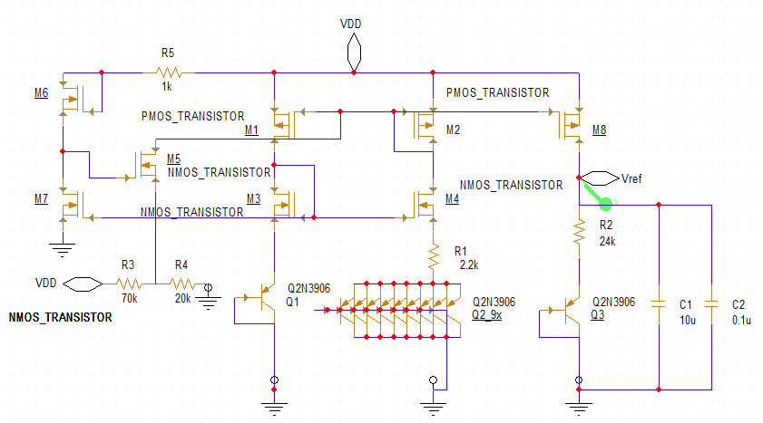 |

M7 (in the startup circuit) was implemented as 6 series-stacked NMOS
transistors to increase its effective channel area (and thus conductance)
relative to M6. Initial values for R1, R2, and the BJT area scale factor
`n` were estimated from the theory above, then tuned empirically during
simulation.

## Results

### Temperature sweep (0–100°C)

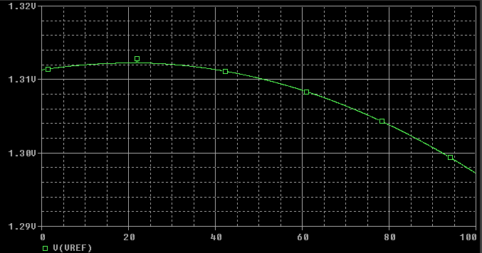

```
TC(ppm) = | (VRef(T2) - VRef(T1)) / (VRef_nom × (T2 - T1)) | × 10^6
        = | (1.298 - 1.311) / (0.5 × (1.298 + 1.311) × 100) | × 10^6
        = 99.6 ppm/°C
```

**99.6 ppm/°C** — just under the 100 ppm/°C target.

### Line noise rejection

A 1VAC signal was superimposed on the DC supply rail to emulate real-world
supply noise (EMI, switching noise from an SMPS, etc). Two decoupling
capacitors (10μF + 0.1μF) at V_REF filter both low- and high-frequency
components:

| Before decoupling | After decoupling |
|---|---|
| 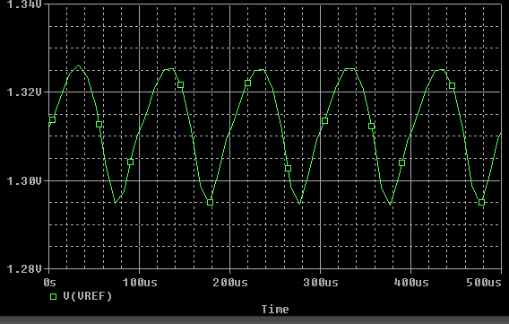 | 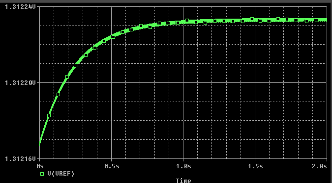 |

The ripple is almost entirely suppressed after adding the decoupling caps,
confirming good power-supply rejection.

### Power consumption

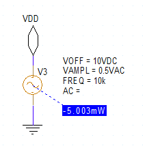

**5 mW** measured — low enough for energy-sensitive applications like IoT.

## Conclusion

The circuit met its core target: a temperature-insensitive ~1.3V reference
at 99.6 ppm/°C (vs. a 100 ppm/°C goal), clean output under simulated supply
noise, and 5mW power draw. Possible future work noted in the original
report: adding curvature correction, and further optimizing startup
behavior at low temperatures.

## Files

- `bandgap-reference.dsn` / `.opj` — OrCAD schematic and project files
- `q2n3906.lib` / `5um_bnr_cmos.lib` — SPICE models used in simulation
- `ENSC_325_Bandgap_Reference_Report.pdf` — full original write-up
- `images/` — schematics and result plots (extracted from the report,
  used above)

## Team

Group project (3 members) — my contribution was simulations and the
written report.
