# High-Voltage Flyback Converter — Analytic Systems

**Co-op Work Term 3 (MSE 493) — Analytic Systems, Delta BC**

An independent power electronics project built during a co-op at Analytic
Systems: a flyback converter paired with a Cockcroft-Walton voltage
multiplier, generating adjustable 300–1000V surges to test a high-voltage
inverter's surge disconnect board.

## Problem

Analytic Systems needed to validate a high-voltage surge disconnect board —
mounted at the input of a high-voltage inverter, it detects surges up to
1kV (e.g. from lightning) and disconnects the input to protect the
inverter. Testing it required a way to generate controlled ~1000V test
surges from a 24V, 2A adapter, to charge a 0.5μF capacitor that would be
discharged through a MOSFET to simulate a line surge. A flyback converter
was chosen for the job — good isolation and a wide output voltage range,
well suited to generating the high-voltage pulses needed.

## Initial Design

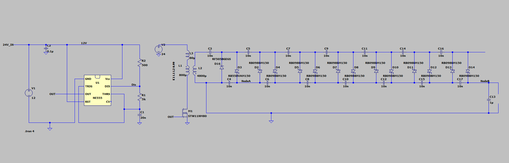

A 555 timer forms the oscillator core (~10kHz initially), stepped down
from 24V to 15V for the timer's supply. R1/R2/C1 set the oscillator
frequency:

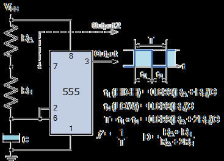

The primary-side switch was an FDPF39N20 N-channel MOSFET (200V Vds),
driving a Würth Elektronik flyback transformer (750811613) configured for
a 7.7:1 step-up ratio — chosen after the ideal 1:7 winding combination
turned out to exceed the transformer's isolation rating between windings:

| Transformer | Winding diagram |
|---|---|
| 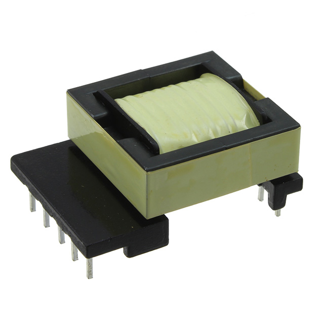 | 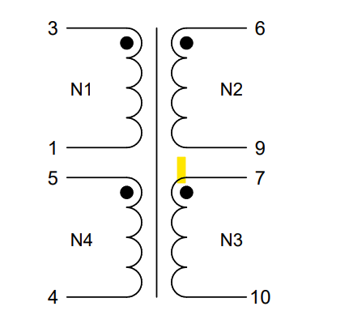 |

A 7-stage Cockcroft-Walton voltage multiplier follows the transformer to
reach the full 1kV output, simulated first in LTSpice before building.

## Design Iteration

**Problem 1 — insufficient gate drive.** The 555's ~5V square wave
couldn't switch the MOSFET fast enough, leaving it in the linear region and
overheating to 100°C within seconds:

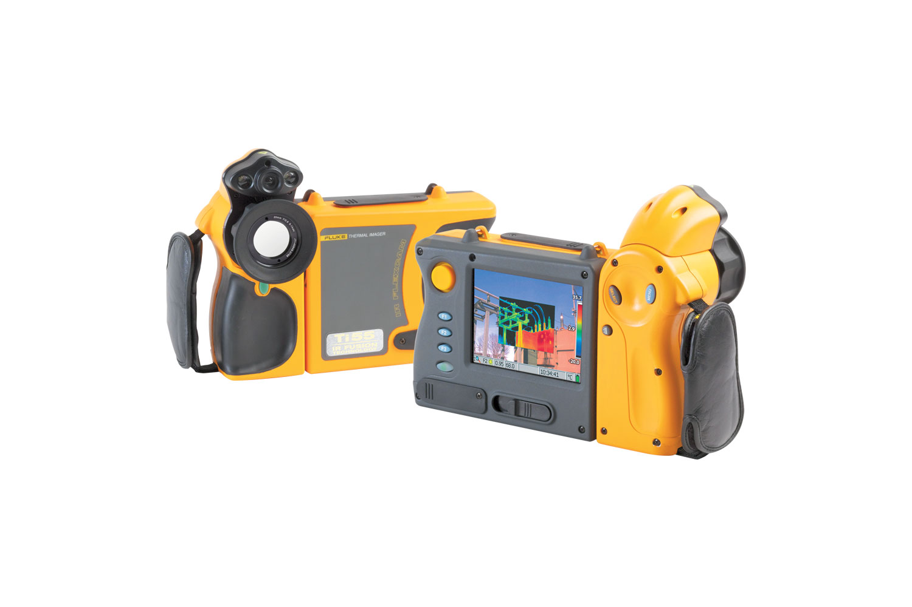

Fixed by adding a MIC4455YM gate driver to bring the gate signal up to the
required 15V.

**Problem 2 — transformer kickback destroyed the MOSFET.** Once the
voltage multiplier was connected to the secondary side, leakage-inductance
kickback spikes of several hundred volts destroyed the 200V-rated MOSFET
almost instantly. Fixed by switching to an FCH023N65S3-F155 (650V,
ultra-low gate charge) and adding an RCD snubber (per Fairchild's AN-4147
guidelines) to clamp the spikes.

**Problem 3 — nonlinear multiplier behavior + thermal/current limits.**
The transformer's secondary waveform wasn't a clean square wave, so the
Cockcroft-Walton multiplier's output was nonlinear with voltage drops at
each stage. Addressed with: dual coarse/fine potentiometers (10kΩ + 15kΩ,
replacing a fixed resistor) for adjustable output between 400–1000V; a
faster oscillator (1nF instead of 20nF, pushing frequency from 10kHz to
80kHz); a 20Ω gate resistor to tame driver heating from an added output
filter capacitor; parallel current-sharing resistors plus a cooling fan to
manage thermal limits within the power adapter's 2A rating; and a 2MΩ
bleeder resistor bank (six 250kΩ resistors in series) so the output
discharges safely with no load connected.

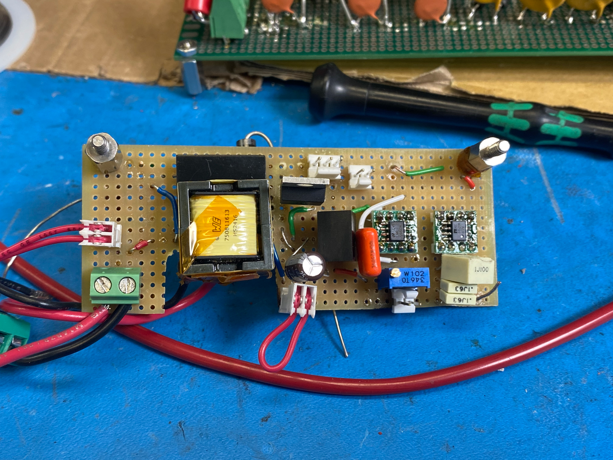
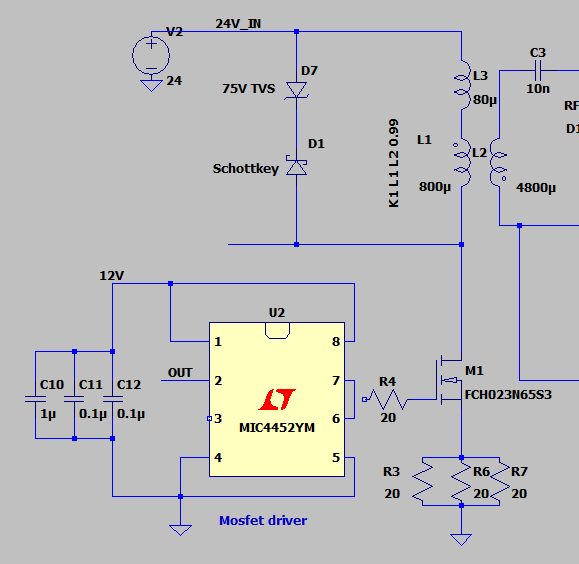

## Final Design

Settled on a **7-stage** Cockcroft-Walton multiplier — a practical balance
between output voltage and the efficiency/component-stress cost of adding
more stages:

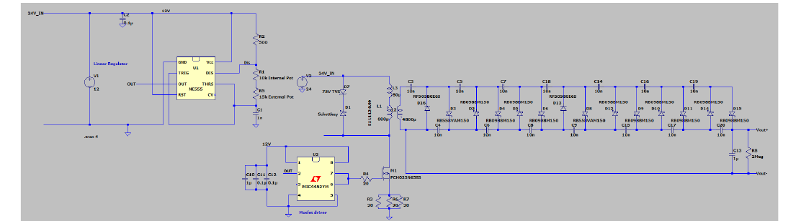

Built across two isolated boards (oscillator/driver separate from the
voltage multiplier) to prevent the high-voltage secondary from arcing
across low-voltage traces:

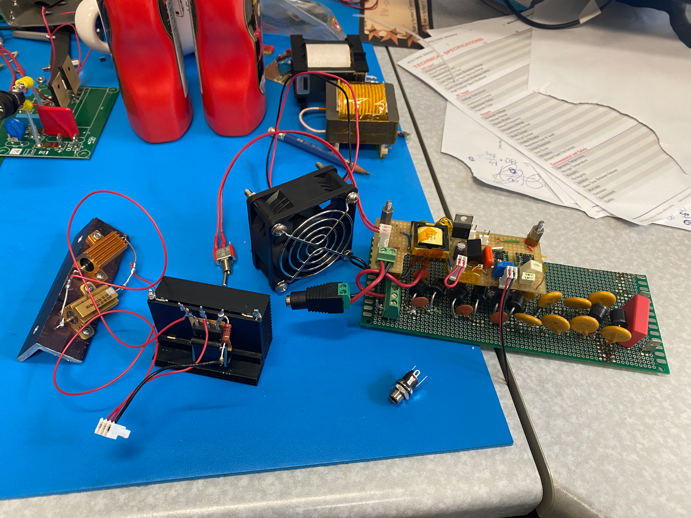

Housed in a custom enclosure — designed in SolidWorks (24 × 18 × 10cm),
3D-printed on a Bambu Lab X1-Carbon, with mounting points for the
heatsink, fan, and switch:

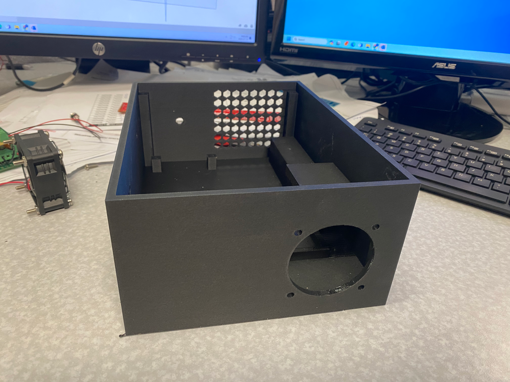

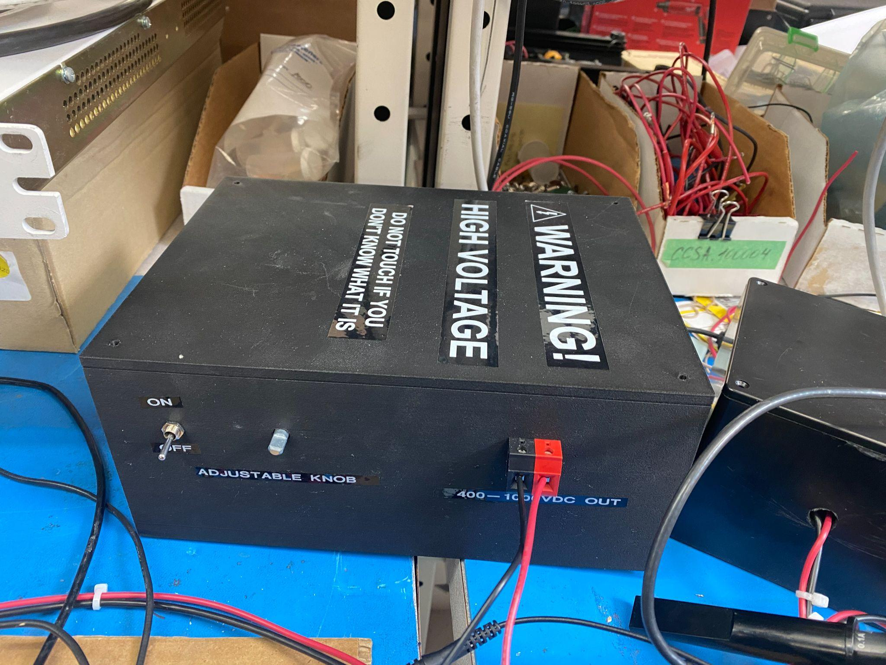

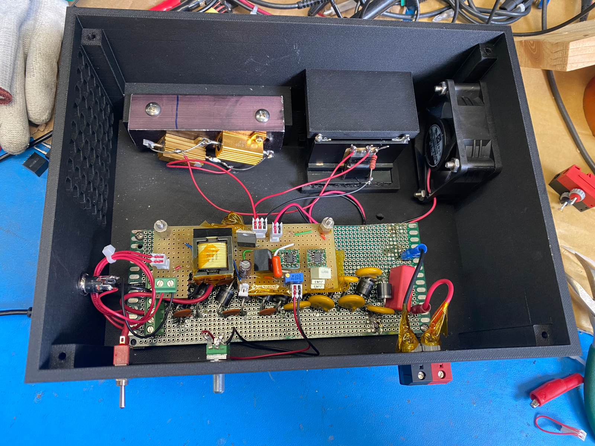

## Outcome

Delivered an adjustable **300–1000V** surge source in a safety-labeled
enclosure, used to successfully test the disconnect board. Output wasn't
perfectly linear once a resistive load was connected — voltage varied
across that 300–1000V range with some residual spikes up to 80V, traced
to oscillator instability at high frequency. The clearest path to fixing
that: a dedicated flyback controller IC, which would give proper feedback
control over frequency and duty cycle instead of the open-loop 555 timer
approach used here.

## Files

- `Analytic_Systems_Flyback_Converter_Report.pdf` — full original co-op
  work term report
- `images/` — all figures from the report, used above

## Role

Independent project — full design, iteration, and testing done solo,
under the guidance of Analytic Systems' Director of Engineering.
