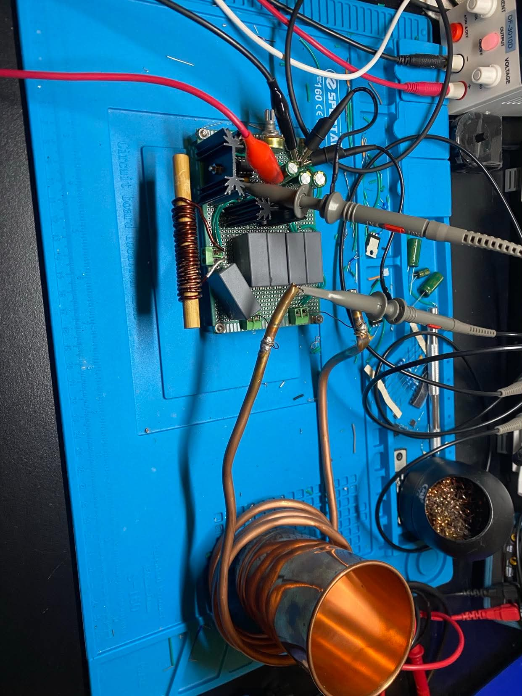
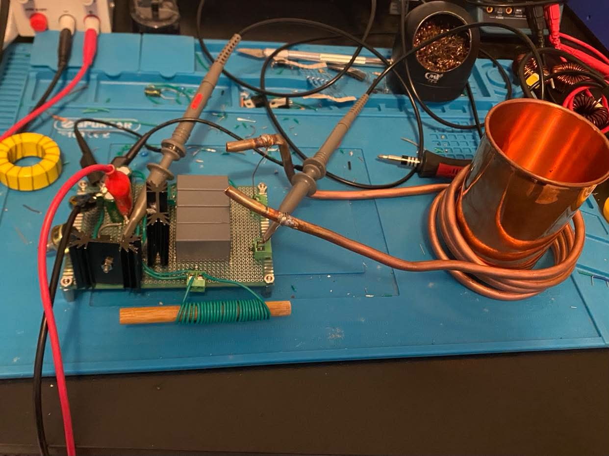
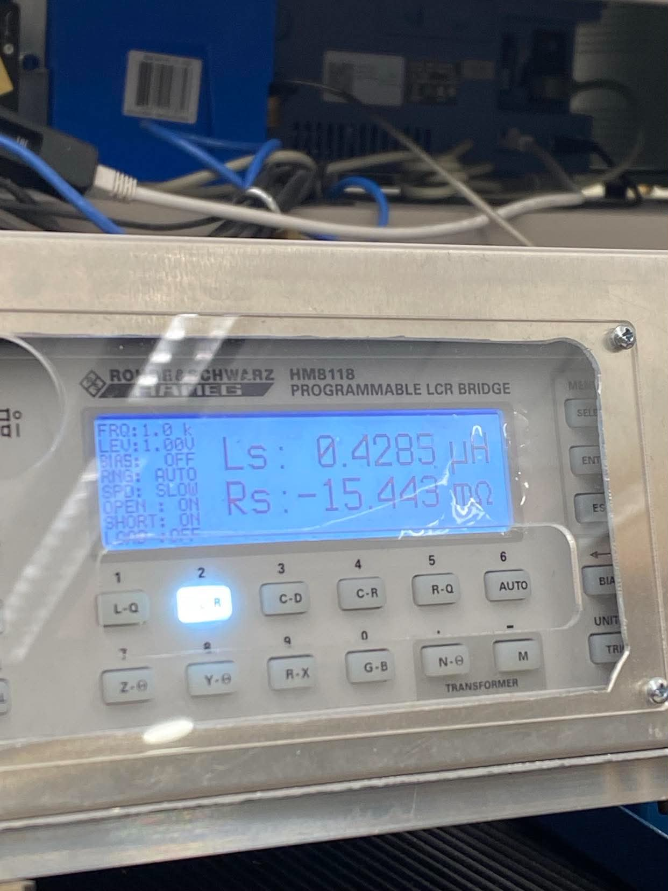
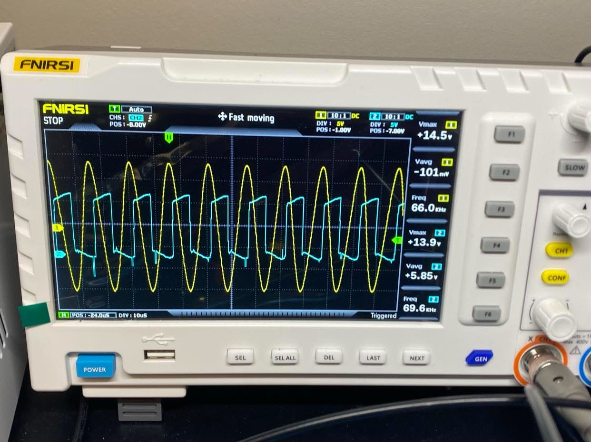
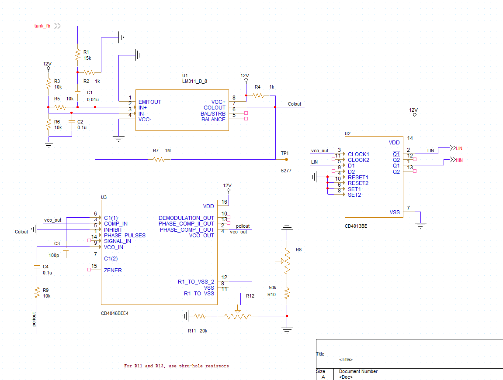
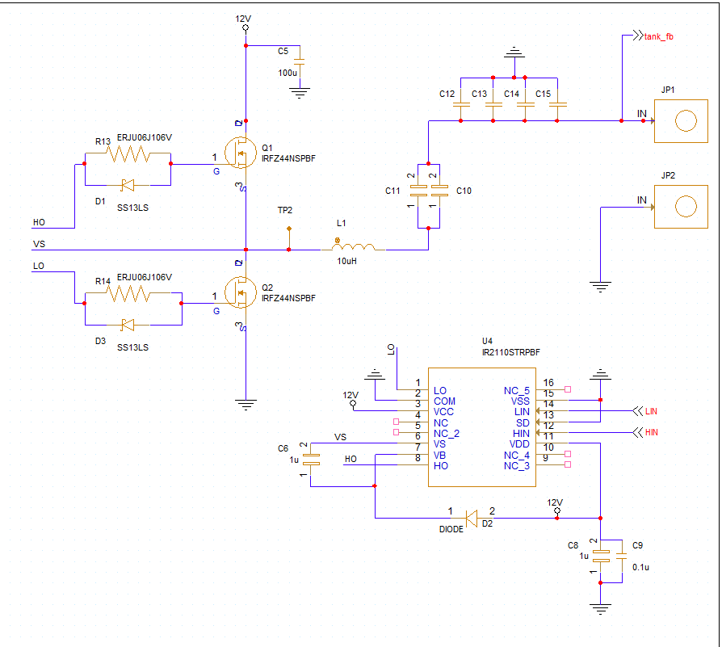

# Half-Bridge Resonant Induction Heater

*A 500W-class, 12V LCLR resonant induction heater — from a startup's first working prototype to a self-driven closed-loop PLL redesign.*

## Status

🔧 **In progress.** V1 was completed and validated during the original startup engagement. The current closed-loop PLL redesign is in the PCB layout stage.

## Background

Joined a friend's hardware startup (a team of 5–6) as lead engineer, tasked with designing the company's induction heating stage from scratch and integrating it with the founder's MCU/control board. Worked from home, reporting progress to the founder every 3–4 days, while studying full-time.

The one confirmed target requirement: heat a steel cup of water to 60°C in 60 seconds.

## V1 — the startup prototype (completed, April 2026)

A first working driver came together in about a month using a basic self-oscillating (Mazzilli-style) ZVS configuration — but it quickly became clear the circuit offered no real control over its own switching behavior, too unpredictable and unstable for a commercial product.

What followed was a self-taught rebuild from the ground up: induction heating theory, hand-selected operating frequency, and manually sized tank capacitors and coil inductance, driven through an **IRS21531D** self-oscillating half-bridge driver IC.

*The V1 prototype: perfboard IRS21531D driver stage feeding a hand-wound copper work coil.*

**Key failures worked through on the way to a stable design:**

- Driving the LCLR tank at 150kHz pushed the IRS21531D past its gate current sourcing/sinking limits, causing severe gate signal distortion that forced the converter into the unstable "Left Pole" capacitive region.
- Skin effect at 150kHz concentrated heating in the work coil itself rather than the workpiece.
- Heating the steel workpiece past its Curie point (~700°C) collapsed its magnetic permeability mid-run, sharply shifting the tank's resonant frequency and destroying Zero-Voltage Switching (ZVS).
- Under-Voltage Lockout (UVLO) transients reset the driver mid-run during high-current draws.
- Repeated hardware casualties along the way: burned MOSFETs, dead gate driver ICs, overcurrent failures.

**Fixes that got it stable:** lowered the target operating frequency to roughly 70kHz by paralleling additional MKP film capacitors onto the tank, and split the power delivery into a 12V main MOSFET bus with its own separate logic rail, so high-current transients on the power side couldn't trip UVLO on the driver.

*Work coil inductance measured on an LCR bridge — the kind of hand-measured value that went into sizing the tank.*

*Drive and tank waveforms on the scope, confirming the stabilized ~66–70kHz operating point.*

**Outcome:** V1 met the founder's target — heating a steel cup of water to 60°C in 60 seconds — running the stabilized IRS21531D driver at ~70kHz off the 12V bus, with operating frequency set manually via a potentiometer.

The startup lost its funding and shut down before the MCU/control-board integration work was finished.

## V2 — the closed-loop PLL redesign (in progress)

The open-loop, fixed-frequency topology had a structural limitation: it couldn't adapt to a dynamically shifting load. Testing showed continuous thermal runaway and MOSFET failures whenever conditions drifted from the tuned operating point — confirming that static, open-loop frequency control isn't viable for a real induction heater, since the tank's resonance itself moves as the workpiece heats through its Curie point.

After the shutdown, I kept developing the design on my own, rebuilding it around closed-loop control:

- **Power bus kept at 12V**, currently sized for roughly 500W.
- **Half-bridge power stage:** IRFZ44N MOSFETs (Q1/Q2) driven by an **IR2110** high/low-side gate driver, with gate resistors and anti-parallel Schottky diodes (SS13LS) on each gate for asymmetric turn-on/turn-off timing. A 10µH inductor (L1) and a parallel capacitor bank (C10–C15) form the resonant tank, tapped at `tank_fb` for feedback.
- **PLL feedback network:** the `tank_fb` voltage feedback is squared into a clean clock edge by an **LM311** comparator, which feeds the phase comparator of a **CD4046** PLL IC. The CD4046's VCO output is shaped into the complementary drive signals the IR2110 needs by a **CD4013** dual flip-flop.
- No current-sense transformer in this version — feedback is purely voltage-based, tapped directly off the tank.

Replacing the potentiometer-set frequency with this PLL loop means the drive frequency tracks the tank's actual resonant point in real time, instead of assuming it stays put as the workpiece heats.

*PLL feedback network: LM311 zero-cross comparator, CD4046 PLL, CD4013 dual flip-flop shaping the complementary drive signals.*

*Half-bridge power stage: IR2110 gate driver, IRFZ44N MOSFETs, and the LCLR resonant tank.*

## Next

- Bench-verify the PLL loop filter can track an artificial frequency shift without overshooting.
- Finish the mathematical calculation and component selection for the PLL feedback loop's RC filter.
- Complete PCB layout for the V2 revision (in progress now).

## Skills this proved out

Self-taught RF/power electronics theory under real deadline pressure, half-bridge and resonant tank design, root-causing hardware failures (gate drive distortion, thermal runaway, UVLO resets) rather than just replacing parts, and closed-loop control design (PLL) for a system whose operating point moves during operation.
