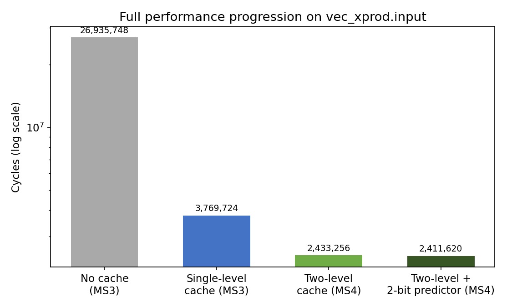
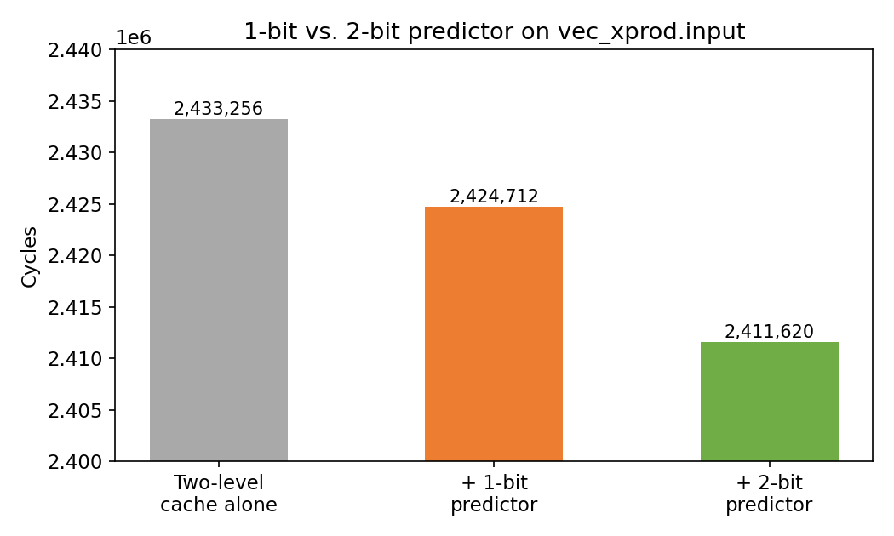

# RISC-V Cycle-Accurate Pipeline Simulator

**ENSC 254 (Computer Architecture) Final Project — 4-person team**

A cycle-accurate simulator for a 5-stage RISC-V pipeline, built across four
milestones: a basic pipeline, hazard detection & forwarding, cache
integration, and a final milestone adding a two-level cache hierarchy plus
branch prediction.

## Overview

- **MS1 — Basic pipeline**: IF/ID/EX/MEM/WB datapath, control-signal
  generation, ALU control decode, branch condition logic
- **MS2 — Hazards**: EX/MEM forwarding, load-use stalls, and control-hazard
  flushing on taken branches
- **MS3 — Cache**: every load/store hits a simulated cache; a design-space
  exploration across cache sizes found the best hit rate at each size
- **MS4 — Extensions**: split L1-I/D + unified L2 cache, and 1-bit/2-bit
  branch predictors

## Results

- Single-level cache: **7.15× speedup** on the main benchmark (95.0% hit
  rate)
- Two-level cache: **11.07× speedup** over no cache at all
- 2-bit branch predictor: **96.95% accuracy**, saving ~2.5× more cycles
  than a 1-bit predictor

All four milestone test suites passed in full.

## My Contribution

Control and hazard/forwarding logic (`stage_helpers.h`), the cache
subsystem (`cache.c`), and the branch predictor's test cases and final
report.

## Files

- `src/` — simulator source and milestone test scripts
- `dse_1k/2k/4k/8k.txt` — winning cache configs from the MS3 design space
  exploration
- `RISCV_Simulator_Report.pdf` — full write-up
- `images/` — performance charts, used above
