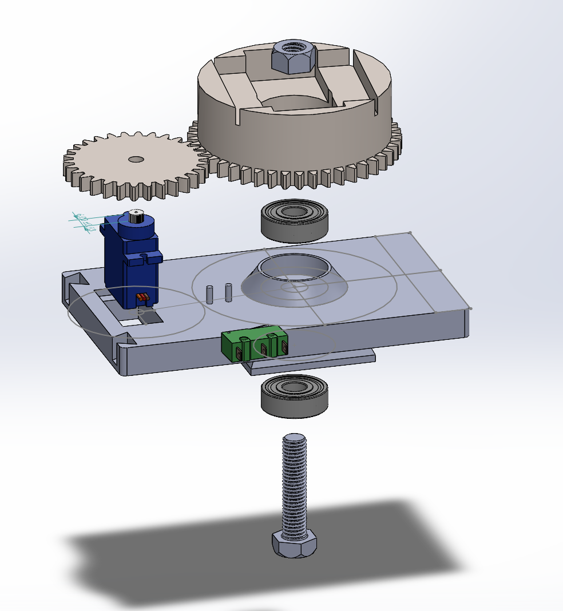

# SoccerCam — Ball-Tracking Motorized Tripod

*A phone-mounted camera rig that pans to keep the ball centered, automatically, during a live match.*

---

## // origin

Started from a real need, not a spec sheet: a proper way to film full matches with my team, without dedicating a player or a parent to holding a phone the whole game. The footage is for reviewing and improving play — but just as often, it's simply to watch ourselves play. That's the part that actually matters most.

## // the idea

A phone mounted on a motorized tripod head. The phone runs a local app that detects the ball on-device and sends movement commands over Bluetooth to a microcontroller, which drives the pan motor to keep the ball framed. No cloud processing, no wireless tether between a separate camera unit and a phone — the phone *is* the camera, mounted directly on the motor unit.

## // my role — mechanical, embedded, and control

This was my first project at this level of mechanical design, entirely self-taught through it:

- **Mechanical design (SolidWorks):** Bought an existing tripod, reverse-engineered its mounting socket by hand-measuring every connection point, then designed the full motor + gear platform around it from scratch — shafts, bolts, nuts, bearings, gear housings. Landed on a bevel gear layout (module 1.5, 45T fixed / 30T pinion) after working through why a co-located worm/spur setup didn't fit the tripod's geometry. All parts 3D-printed on my own printer.

*Exploded CAD view of the pan drive: servo, gear pair, base plate, bearings, and shaft.*

- **Electronics:** Full circuit build and soldering, including a limit-switch homing system to establish a ground-truth reference position for the platform.

- **The constraint that changed the design:** the housing and mounting slots were already built around a positional SG90 servo — but that servo variant can't rotate past 180°, which doesn't work for continuous pan tracking. Rather than redesign the housing, I swapped in the continuous-rotation SG90 variant and built a **software encoder** from scratch: since continuous servos give no absolute position feedback, I implemented dead-reckoned position estimation corrected against the limit switch, plus a full motor movement algorithm (soft/hard travel limits, smooth ramping) to make it behave like a positional system.

- **Bluetooth protocol:** Designed and implemented the BLE communication layer (NimBLE on the ESP32 side) between the phone and the motor unit, including the command protocol for movement instructions.

- **Tracking math:** Own the distance + vectoring algorithm — the layer that takes the phone's normalized ball-offset detection and converts it into a scientifically grounded control signal (proportional control with an expo response curve and deadzone) transmitted over BLE. The phone owns the tracking math; the MCU owns translating that signal into correctly scaled motor movement.

My friend built the iOS app and the on-device AI ball detection (Apple Vision/CoreML).

## // current status

Hardware is built and mechanically/electronically integrated. Currently in the calibration phase — tuning the empirical constants that only reveal themselves once the physical system is running (homing direction, max angular speed, tracking timeout, expo curve exponent).

## // skills this proved out

SolidWorks mechatronics design from a physical constraint inward, embedded systems on ESP32 (BLE, motor control, sensor fusion via limit switches), closed-loop control theory under real hardware limitations, and reverse-engineering a physical interface from a bought part with no datasheet.

---

*[Photos/CAD renders/build shots — 4–8 to slot in: recommend interspersing 2–3 in the "mechanical design" section, 1–2 in "electronics," and 1 hero shot at the top]*
